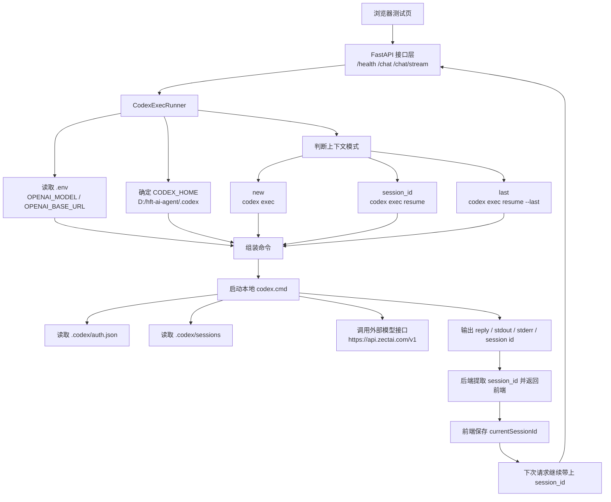

# 系统架构说明

## 1. 总体结构

当前项目是一个把浏览器请求转成 `codex exec` 调用的本地 HTTP 服务，分成四层：

1. 页面层
   
   - 测试页直接内嵌在 [app/codex_http.py](/D:/hft-ai-agent/app/codex_http.py) 的 `TEST_PAGE_HTML` 中。
   - 页面负责采集 `message`、`cwd`、`model`、`continue_context`、`session_id`。

2. API 层
   
   - FastAPI 提供三个核心接口：
   - `GET /health`
   - `POST /chat`
   - `POST /chat/stream`

3. 执行适配层
   
   - [app/codex_http.py](/D:/hft-ai-agent/app/codex_http.py) 中的 `CodexExecRunner` 负责：
   - 读取 [`.env`](/D:/hft-ai-agent/.env)
   - 解析 `OPENAI_MODEL`、`OPENAI_BASE_URL`
   - 构建 `codex exec` 或 `codex exec resume`
   - 启动本地 Codex CLI
   - 提取最终回复、stdout、stderr、session_id

4. 本地状态层
   
   - 所有 Codex 本地状态统一放在 [`.codex`](/D:/hft-ai-agent/.codex) 下：
   - `auth.json`：登录态
   - `sessions/`：上下文会话
   - `skills/`：项目技能
   - 其他 `tmp`、`log`、`sqlite` 文件：运行态数据

## 2. 上下文会话机制

系统不是靠 HTTP 长连接保存上下文，而是靠 Codex CLI 的持久化会话来续接上下文。

### 首次请求

前端发送：

```json
{
  "continue_context": false,
  "session_id": null
}
```

后端判定为新会话，执行：

```bash
codex exec ...
```

Codex CLI 在输出中生成 `session id: ...`，后端把它提取出来并返回给前端。

### 后续请求

前端保存上一次返回的 `session_id`，下次请求时带上：

```json
{
  "continue_context": true,
  "session_id": "上一次返回的 session_id"
}
```

后端改为执行：

```bash
codex exec resume <session_id> ...
```

如果只有 `continue_context=true` 但没有具体 `session_id`，则退化为：

```bash
codex exec resume --last ...
```

### 为什么能续上

因为当前默认 `ephemeral=false`，所以会话会保存在 [`.codex/sessions`](/D:/hft-ai-agent/.codex/sessions) 中。  
每次 HTTP 请求虽然都会新建一个 Codex CLI 进程，但只要：

- `CODEX_HOME` 不变
- `session_id` 还有效
- `.codex/sessions` 还在

就能继续之前的上下文。

## 3. 当前关键文件

- [codex_http.py](/D:/hft-ai-agent/codex_http.py)
  - 启动入口，负责启动 Uvicorn
- [app/codex_http.py](/D:/hft-ai-agent/app/codex_http.py)
  - 页面、接口、命令拼装、上下文续接逻辑
- [tests/test_codex_http.py](/D:/hft-ai-agent/tests/test_codex_http.py)
  - 环境变量、命令拼装、stream、session_id 等测试
- [`.env`](/D:/hft-ai-agent/.env)
  - 默认模型和 API 地址
- [`.codex`](/D:/hft-ai-agent/.codex)
  - 本地认证、会话、skills

## 4. 流程图


